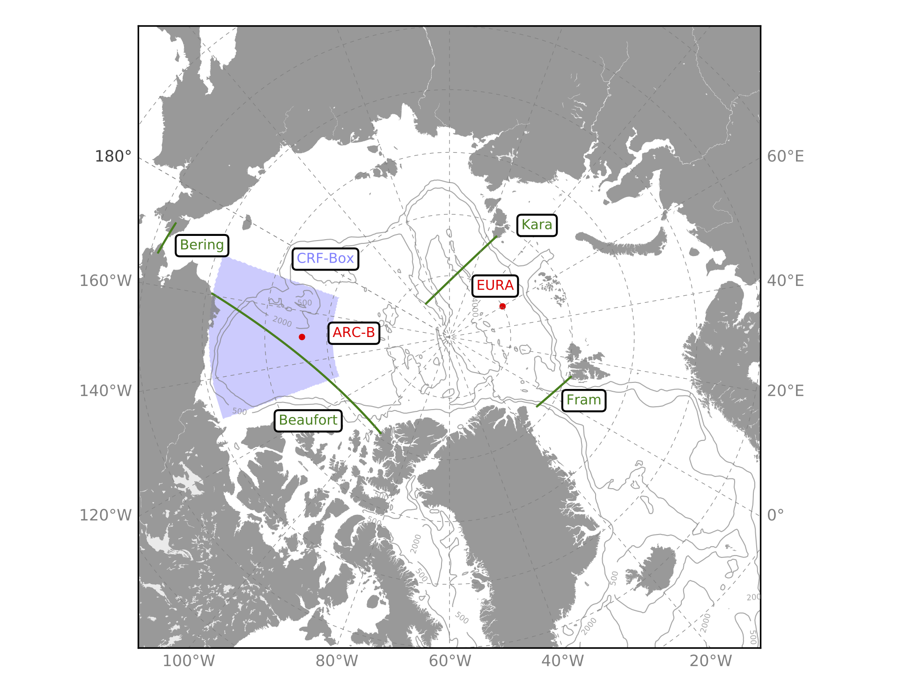
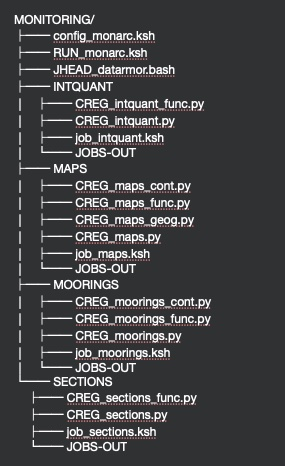

# ARCTIC-MONITORING
This is a set of Python scripts to assess ocean/sea-ice numerical simulations over the Arctic. Diagnostics and plots are done over and around the Arctic basin. Few sections, moorings and boxe are shown on the following figure where and through which few diagnostics are computed and compare to few available inferred in-situ or satellite observations.
 

In the following, basic information are listed to be able to get and to run the Arctic monitoring. 

**CAUTION: It has been originaly developped in order to run in only few specific computing system. If it is installed on a new architecture, few modifictions will be required to make it running properly; these modifications are not documented yet hereafter. Finally, for convenience, the monitoring relies on a hardcoded specific model data filenames as paths structure as well that would require potential deep changes.** 

1 - EXTRACTION:  
2 - INSTALLATION: 
3 - USE THE MONITORING: 
4 - THE MONITORING TREE: 
  
---
## 1 - EXTRACTION:  
Create a directory that will be used as a repository that will NOT change over time.  
> mkdir MONITOR 
> cd MONITOR 

Extraction:  
> git clone git@github.com:ctalandi/ARCTIC-MONITORING.git

---
## 2 - INSTALLATION: 
For a specific configuration, CREG025.L75 for instance and associated sensitivity experiments.   
Go into the bin sub-directory and execute the mkmonarc_stdal script as below: 
> cd ./bin  
> chmod 750 mkmonarc_stdal 
> ./mkmonarc_stdal CONFIG-NAME EXPNAME TARGETDIR  
**CONFIG-NAME** is the name of the configuration 
**EXNAME** is the name of the experiement relying on the CONFIG-NAME  
**TARGETDIR** is the path where the monitoring will be installed  
The final command wil create the TARGETDIR/CONFIG-NAME-MONARC/CONFIG-NAME-EXPNAME directory.

---
## 3 - USE THE MONITORING: 
Go into the directory just created before  
> cd TARGETDIR/CONFIG-NAME-MONARC/CONFIG-NAME-EXPNAME  

Note: You can change/adapt as you want all files located under this directory and sub-directories  
 
  1. Adapt the user’s file config_monarc.ksh to your case. 
It is there that the user can set the kind of diagnostics to perform.  

Few key variables below:  
> **REF_YEAR** is the starting year of the simulation 
> **XIOS** to specify in which kind of subdirectory data are stored either 1m or 5d  

For instance /home/datawork-lops-drakkarcom/SIMULATION-OUTPUTS/FREDY/CONFIGS/NANUK025.L75/NANUK025-ILBOXE68-MEAN/1m 

The path where model data are stored has to be set through the DATA_DIR variable depending the target machine. 
The default path is set to /home/datawork-lops-drakkarcom/SIMULATION-OUTPUTS/FREDY/CONFIGS/${CONFIG}/${CONFIG}-${CASE}-MEAN/  

The following variables must be set before runnning: 
Specify input files name (should be stored in the GRID_DIR directory to set as well) 

> **INIT_FILE**=CREG025.L75-BCTGE27NTMX_init_gridT.nc    # Initial file with both temp/sal initial state store in GRID_DIR directory 
> **BATH_FILE**=CREG025_bathy_etopo1_gebco1_smoothed_coast_corrected_bering_may11_time_ct20181224.nc # Bathymetry file store in GRID_DIR  > directory 
> **GRDH_FILE**=CREG025.L75_mesh_hgr.nc              # Horizontal mesh grid file 
> **GRDZ_FILE**=CREG025.L75_mesh_zgr.nc              # Vertical mesh grid file 
> **MASK_FILE**=CREG025.L75_byte_mask.nc             # Mask grid file  
> **COOR_FILE**=coordinates_CREG_R025_lombok+ombai_v2_vh20161220.nc                    # Coordinates grid file   

  2. Run the monitoring  
> ./RUN_monarc.ksh year1 year2  

At the end of the process, results will be stored into sub-directories as FIGS-CREG025.L75 and NCDF-CREG025.L75 respectively for 
the figures and NetCDF data for either MAPS, SECTIONS,MOORINGS or INTQUANT diagnostics. 

In each sub-directories, MAPS, SECTIONS,MOORINGS or INTQUANT there are : 
- one dedicated job called job_xxx.ksh   
- and few python scripts  
All steps for getting all input files is done in the job, as for model data and observations as well.   
Most of the time, there are 3 python scripts.  
- *CREG_xxx.py* the master one  
- *CREG_xxx_func.py*  with functions only  
- *CREG_xxx_cont.py* with  plotting specifications only  

## 4 - THE MONITORING TREE: 

